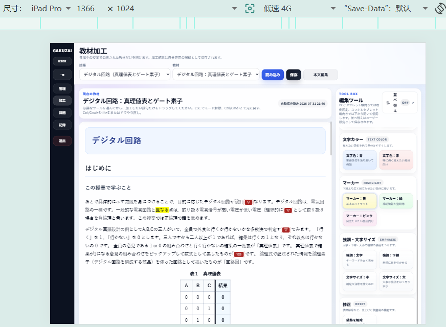
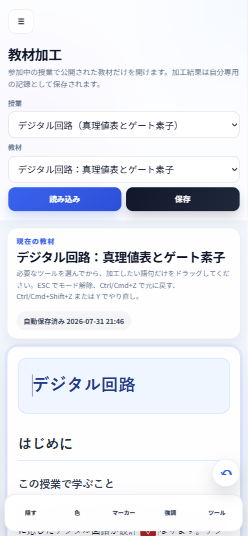
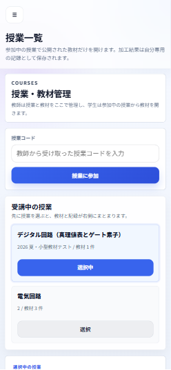

# GAKUZAI Demo

[English](README.md) | [日本語](README.ja.md) | [中文](README.zh-CN.md)

GAKUZAI Demo は、授業中に学生が電子教材を自分の理解に合わせて加工し、その学習過程を教師が分析できるようにする、ローカル運用向けの授業支援プロトタイプです。教師 PC を教室内サーバーとして起動し、学生は同じ Wi-Fi / LAN からスマートフォン、タブレット、PC のブラウザで利用する想定です。

このプロジェクトの中心テーマは、学生が同時に教材を操作する授業環境で、すべてのクリックを個別の DB 書き込みにせず、意味のある操作ログを安定して収集することです。


## 画面例

| iPad / タブレット表示 | スマートフォン表示 | スマートフォン表示 |
|---|---|---|
|  |  |  |

| 学生の授業画面 | 学生の教材加工画面 |
|---|---|
|  |  |

## ポイント

- フロントエンドでは、学生が教材にマーカー、キーワード非表示、ポップアップメモ、Undo / Redo、保存などを行えます。
- バックエンドでは、認証、授業管理、教材管理、課題、分析、CSV 出力を Express API として実装しています。
- データベースは SQLite なので、クラウドサーバーなしで教師 PC 上にローカル配置できます。
- 操作ログはブラウザ側キューで一度まとめ、同時アクセス時のリクエスト数を減らします。
- サーバー側ではバッチ API と SQLite トランザクションでまとめて保存します。
- SQLite の WAL モードと busy timeout により、授業規模の読み書き競合を抑えています。
- `stress-test.js` で 40 人同時利用を想定した操作ログ送信を確認できます。

## 主な機能

### 学生側

- 学生アカウント登録・ログイン
- 授業コードによる授業参加
- 公開教材の閲覧
- 自分の理解に合わせた教材加工
- 授業向け加工ツール
  - マーカー
  - 文字色
  - 太字・下線
  - キーワード非表示・置換
  - ポップアップメモ
  - 装飾解除
  - Undo / Redo
- 加工済み教材の保存
- 課題回答の提出
- スマートフォン、タブレット、PC ブラウザでの利用

### 教師側

- 教師アカウント登録・ログイン
- 授業の作成・管理
- 教材の公開・非公開切り替え
- 教材に紐づく課題作成
- 学生の参加状況・保存状況確認
- 授業、教材、学生、ブロック、操作種別ごとの操作ログ分析
- 操作ログの CSV 出力

### システム側

- Node.js + Express によるローカルサーバー
- プロジェクト内に生成される SQLite データベース
- JWT による API 認証
- bcryptjs によるパスワードハッシュ化
- helmet と express-rate-limit による API 保護
- localStorage に永続化されるブラウザ側操作キュー
- バッチ操作ログ API とトランザクション保存
- SQLite busy timeout と WAL モード

## 高同時アクセスに対するキュー設計

重要な設計方針は、学生の操作を 1 件ずつ即時送信しないことです。

```text
学生の操作
  -> ブラウザ側キュー
  -> バッチリクエスト
  -> Express API
  -> SQLite トランザクション
  -> operation_events テーブル
```

### なぜキューが必要か

授業中は、多くの学生がほぼ同時に語句へマーカーを付けたり、キーワードを隠したり、メモを追加したり、同じ段落を何度も編集したりします。

たとえば 40 人の学生が 20 回ずつ操作すると、単純実装では約 800 回の小さな HTTP リクエストと DB 書き込みが発生します。ローカル SQLite を使う授業内サーバーでは、これは不要な HTTP 負荷と書き込みロック競合につながります。

このプロジェクトでは、操作イベントをまずブラウザ側に貯め、一定件数または一定時間ごとにまとめて送信します。

### フロントエンド側キュー

`assets/scripts/app.js` でキュー設定を定義しています。

```js
const OPERATION_QUEUE_BATCH_SIZE = 20;
const OPERATION_QUEUE_FLUSH_DELAY_MS = 2500;
const OPERATION_QUEUE_MAX_RETRY_DELAY_MS = 30000;
const OPERATION_QUEUE_MAX_ITEMS = 1000;
```

実装上のポイント:

- 各操作に `clientEventId` を付与し、同じログが重複してキューに入ることを防ぎます。
- 操作はまず `state.operationQueue` に保存されます。
- キューは `localStorage` にも保存されるため、一時的な通信断やリロードに強くなります。
- すぐ送らず少し待つことで、連続操作を少数のバッチにまとめます。
- `operationQueueInFlight` により、同じブラウザから複数バッチが同時送信されることを避けます。
- 送信失敗時はキューを消さず、最大 30 秒までの指数バックオフで再送します。
- タブ非表示、ページ遷移、ブラウザ終了前には、小さな `keepalive` 送信を試みます。

主な実装箇所:

| 内容 | ファイル |
|---|---|
| キュー定数 | `assets/scripts/app.js` |
| キュー追加処理 | `assets/scripts/app.js` |
| バッチ送信とリトライ | `assets/scripts/app.js` |
| ページ非表示・離脱時の保護 | `assets/scripts/app.js` |

### バックエンド側のバッチ保存

バックエンドは次の API で複数イベントを受け取ります。

```text
POST /api/analytics/operation-events/batch
```

このルートは 1 リクエスト最大 50 件のイベントを受け取り、SQLite トランザクション内でまとめて保存します。

```js
const writeBatch = db.transaction(() => events.map(event => (
  insertOperationEventForUser(req.user, event, materialCache)
)));
```

これにより、多数の小さな書き込みを、より少ないまとまった書き込みに変換できます。

### SQLite の競合対策

このデモは大規模公開サービスではなく、教室内ローカル運用を想定しています。そのため SQLite を採用しつつ、授業規模の同時利用に耐えやすいよう以下を設定しています。

```js
db = new Database(dbPath, { timeout: 15000 });
db.pragma('busy_timeout = 15000');
db.pragma('journal_mode = WAL');
db.pragma('foreign_keys = ON');
```

- `busy_timeout` により、一時的な DB ロック時に即失敗せず待機できます。
- WAL モードにより、通常の rollback journal より読み書きの競合を減らせます。
- バッチ保存により、書き込みトランザクション回数を減らします。
- `clientEventId` と重複防止により、再送時も同じ操作ログを二重登録しにくくしています。


## ストレステスト

`stress-test.js` は、一時的な教師、授業、教材、40 人の学生を作成し、各学生が 20 件の操作イベントをバッチ API に送信するテストスクリプトです。

```bash
node stress-test.js
```

出力では以下を確認できます。

- バッチリクエスト数
- 受理された操作イベント数
- 挿入された操作イベント数
- DB に保存された操作イベント数
- 保存された学生数
- 実行時間

```text
40 人 x 20 操作 = 800 操作イベント
800 個別書き込み -> 約 40 バッチリクエストへ削減
```

## 技術スタック

| レイヤー | 技術 |
|---|---|
| フロントエンド | HTML, CSS, vanilla JavaScript |
| バックエンド | Node.js, Express |
| データベース | SQLite with better-sqlite3 |
| 認証 | JWT, bcryptjs |
| API 保護 | helmet, express-rate-limit |
| データ出力 | CSV export endpoint |
| 配置モデル | 教室内ローカルサーバー |

## ディレクトリ構成

```text
Gakuzai_demo/
├─ index.html
├─ app.html
├─ assets/
│  ├─ images/
│  │  ├─ smartphone/
│  │  └─ digital-logic/
│  ├─ scripts/
│  │  ├─ app.js
│  │  ├─ auth-page.js
│  │  └─ sample-lessons.js
│  └─ styles/
├─ server/
│  ├─ app.js
│  ├─ db.js
│  ├─ schema.sql
│  └─ routes/
├─ scripts/
├─ docs/
└─ stress-test.js
```

## 起動方法

### 1. 依存関係をインストール

```bash
npm install
```

### 2. サーバーを起動

```bash
npm start
```

デフォルト URL:

```text
http://localhost:3000/
```

教室内 LAN で確認する場合は、学生端末から教師 PC のローカル IP にアクセスします。

```text
http://<YOUR_LOCAL_IP>:3000/
```

例:

```text
http://192.168.xx.xx:3000/
```

## よく使うコマンド

```bash
npm start
node stress-test.js
node scripts/import-digital-logic-material.js
node --check assets/scripts/app.js
node --check server/app.js
```

PowerShell でポートを変更する例:

```powershell
$env:PORT="3988"
npm start
```

## 環境変数

`.env.example` を参照してください。

| 変数 | デフォルト | 説明 |
|---|---:|---|
| `PORT` | `3000` | サーバーポート |
| `GAKUZAI_DATA_DIR` | `server/data` | データベースディレクトリ |
| `GAKUZAI_DB_PATH` | `server/data/gakuzai.sqlite` | 明示的なデータベースパス |
| `JSON_BODY_LIMIT` | `25mb` | JSON リクエスト本文サイズ |
| `API_RATE_LIMIT` | `2000` | 15 分あたりの API レート制限 |

## データベースに関する注意

メイン DB は実行時に生成されます。

```text
server/data/gakuzai.sqlite
```

WAL モードが有効な場合、以下のファイルも作成されることがあります。

```text
server/data/gakuzai.sqlite-wal
server/data/gakuzai.sqlite-shm
```

これらは通常の実行時ファイルであり、Git にコミットしない想定です。

## 制限事項と今後の改善

このデモは教室内の小規模実験に向いています。大規模公開サービスとして運用する場合は、以下の強化が必要です。

- SQLite から PostgreSQL / MySQL への移行
- HTTPS とドメイン設定
- プロセス管理と監視
- 自動バックアップ
- ロール・権限管理の強化
- ログと運用メトリクスの集中管理

## ライセンス

現在、このリポジトリにはライセンスファイルが含まれていません。デモ用途を超えて再配布・再利用する場合は、`LICENSE` ファイルを追加してください。
