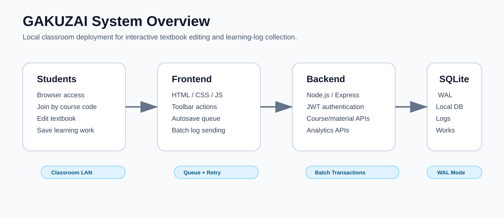
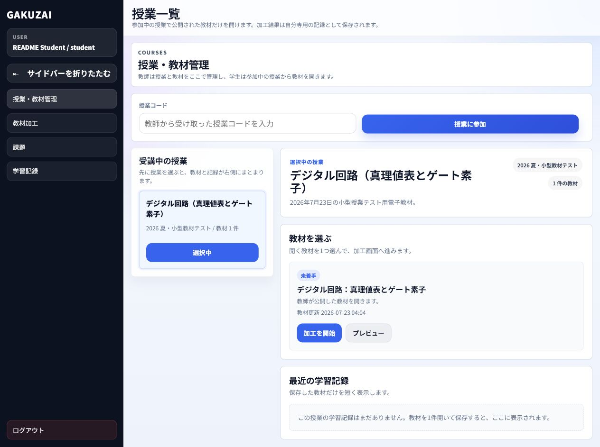
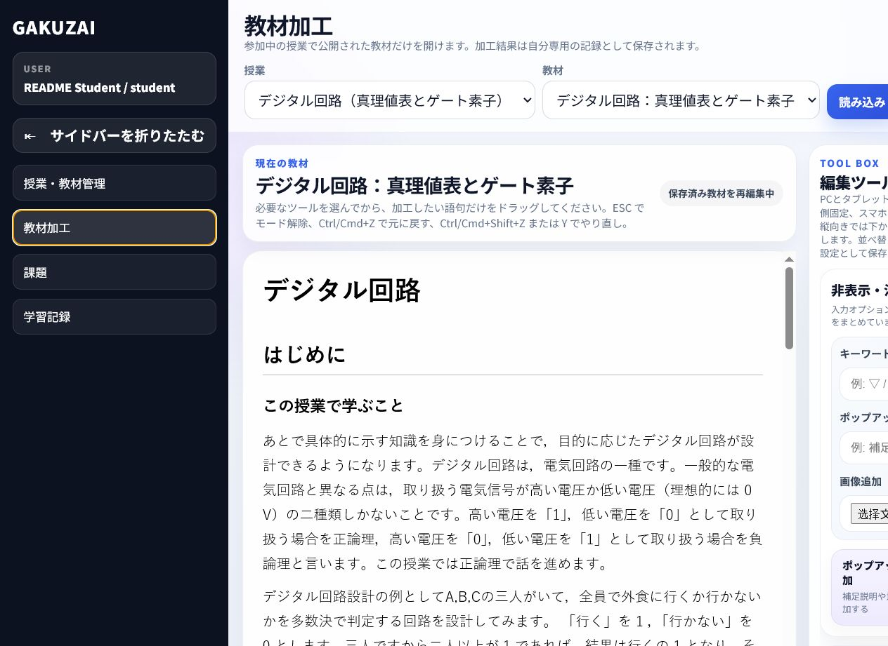
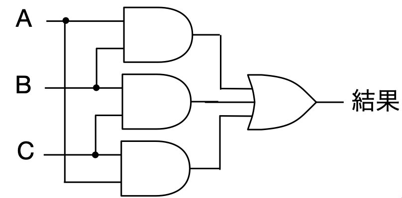
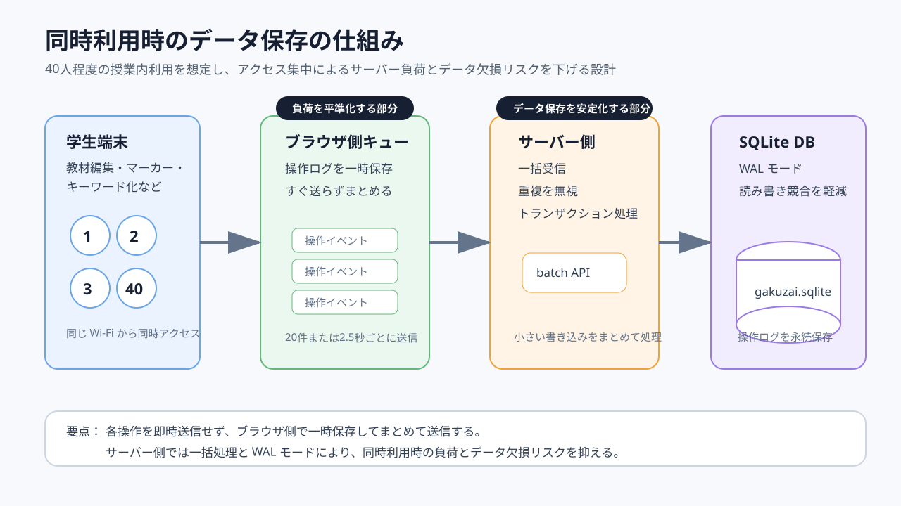

# GAKUZAI Demo



**GAKUZAI Demo** は、授業中に学生が電子教材を自分の理解に合わせて加工し、その操作ログを教師が分析できるようにする小規模授業実験用システムです。  
**GAKUZAI Demo** is a classroom-oriented prototype for interactive textbook editing, learning-log collection, and teacher-side analysis.

本プロジェクトは、ローカル PC を教室内サーバーとして起動し、同じ Wi-Fi / LAN に接続した学生がブラウザから利用することを想定しています。

---

## Actual Screenshots / 実際の画面

| Student course page | Student textbook editor |
|---|---|
|  |  |
| 学生が授業コードで参加し、公開教材を選択する画面 | 学生が教材を読み込み、自分の理解に合わせて加工する画面 |

## Teaching Material / 教材素材

| Digital logic material | Concurrent log saving |
|---|---|
|  |  |
| 教材例：真理値表とゲート素子 | 40人程度の同時利用を想定した保存設計 |

---

## Features / 主な機能

### Student side / 学生側

- 授業コードによる授業参加
- 公開教材の閲覧と加工
- マーカー、文字色、太字、下線、ポップアップ、キーワード化
- 装飾解除
- Ctrl/Cmd+Z による取り消し、Ctrl/Cmd+Shift+Z または Ctrl+Y によるやり直し
- 自分の加工結果の保存・再開
- スマートフォン / タブレット向けの操作 UI

### Teacher side / 教師側

- 授業作成・教材管理
- 教材の公開 / 下書き切り替え
- 学生の保存状況確認
- 操作ログの集計
- CSV エクスポート
- 学習行動の分析画面

### System side / システム側

- Node.js + Express backend
- SQLite local database
- JWT authentication
- Operation-event queueing and batch insert
- SQLite WAL mode for classroom-scale concurrent access
- Local LAN deployment without cloud dependency

---

## Quick Start / 起動方法

### 1. Install dependencies / 依存関係のインストール

```bash
npm install
```

### 2. Start server / サーバー起動

```bash
npm start
```

Default URL:

```txt
http://localhost:3000/
```

For classroom LAN testing, open the server PC's local IP address from student devices:

```txt
http://<YOUR_LOCAL_IP>:3000/
```

例:

```txt
http://192.168.xx.xx:3000/
```

> Do not hard-code the classroom IP address in this repository.  
> 教室で使う IP アドレスは、当日のネットワーク環境に合わせて案内してください。

---

## Classroom Test Flow / 授業内テストの流れ

1. 教師 PC を学校 Wi-Fi / LAN に接続する。
2. 教師 PC で `npm start` を実行する。
3. 学生にアクセス URL と授業コードを配布する。
4. 学生はブラウザからアクセスし、登録またはログインする。
5. 学生は授業コードを入力して授業に参加する。
6. 公開教材を開き、自分の理解に合わせて教材を加工する。
7. 学生は作業終了前に保存する。
8. 教師は保存状況と操作ログを確認する。

Current demo course code:

```txt
DIGI2026
```

Current demo material:

```txt
デジタル回路：真理値表とゲート素子
```

---

## Student Editing Tools / 学生が使う加工ツール

| Tool | Japanese label | Purpose |
|---|---|---|
| Highlight | マーカー：黄 / 緑 / ピンク | 重要な語句や説明を目立たせる |
| Text color | 文字色：青 / 赤 | 意味や注意点を色で分類する |
| Emphasis | 強調：太字 / 下線 | 特に重要な部分を強調する |
| Keyword hiding | 非表示・キーワード化 | 語句を隠す、または短い記号に置き換える |
| Popup note | ポップアップ追加 | 補足説明や自分のメモを追加する |
| Clear style | 装飾解除 | 選択範囲の装飾を元に戻す |
| Save | 保存 | 加工結果を保存する |

### Keyboard shortcuts / ショートカット

| Shortcut | Action |
|---|---|
| `Esc` | 加工モード解除 |
| `Ctrl + Z` / `Cmd + Z` | 元に戻す |
| `Ctrl + Shift + Z` / `Cmd + Shift + Z` | やり直し |
| `Ctrl + Y` | やり直し |

---

## Concurrency Design / 同時利用への対応

This project is designed for small classroom tests, such as around 40 students editing materials at the same time.

本システムは、40人程度の授業内同時利用を想定し、以下の仕組みでサーバー負荷とデータ欠損リスクを下げています。


### Frontend queue / フロントエンド側キュー

Student operations are not sent one by one immediately. They are temporarily stored in a browser-side queue and sent in batches.

学生の操作ログは毎回すぐサーバーへ送信せず、ブラウザ側キューに一時保存してからまとめて送信します。

Key constants:

```js
const OPERATION_QUEUE_BATCH_SIZE = 20;
const OPERATION_QUEUE_FLUSH_DELAY_MS = 2500;
const OPERATION_QUEUE_MAX_RETRY_DELAY_MS = 30000;
const OPERATION_QUEUE_MAX_ITEMS = 1000;
```

### Backend batch API / バックエンド側一括保存

The backend receives operation events through a batch endpoint and writes them in a database transaction.

バックエンドでは複数の操作ログを一括受信し、トランザクションでまとめて保存します。

### SQLite WAL mode / SQLite WAL モード

SQLite is configured with WAL mode to reduce read/write contention during classroom use.

SQLite は WAL モードを使用し、学生の書き込みと教師の読み取りが競合しにくいようにしています。

---

## Stress Test / 簡易負荷テスト

The repository includes a stress test script:

```bash
node stress-test.js
```

Example result from a 40-student classroom simulation:

```json
{
  "requests": 40,
  "accepted": 800,
  "inserted": 800,
  "stored": 800,
  "students": 40,
  "ms": 300
}
```

This means that 800 operation events were accepted, inserted, and stored successfully in the local SQLite database during the test.

---

## Database / データベース

The main database is stored inside the project:

```txt
server/data/gakuzai.sqlite
```

Related SQLite WAL files may appear during runtime:

```txt
server/data/gakuzai.sqlite-wal
server/data/gakuzai.sqlite-shm
```

These files are normal when SQLite WAL mode is enabled.

### Important note / 注意

Do not run multiple business servers with different ports unless you know which database each server is using.

複数のサーバーを同時に起動すると、「どの画面がどのデータベースを見ているのか」が分かりにくくなります。授業テスト時は、基本的に 1 つのサーバーだけを起動してください。

---

## Project Structure / ディレクトリ構成

```txt
Gakuzai_demo/
├─ app.html                         # Main web application
├─ index.html                       # Entry page
├─ assets/
│  ├─ scripts/
│  │  ├─ app.js                     # Frontend application logic
│  │  └─ sample-lessons.js          # Built-in base material list
│  ├─ styles/
│  │  └─ main.css                   # Application styles
│  └─ images/                       # Material images
├─ server/
│  ├─ app.js                        # Express server
│  ├─ db.js                         # SQLite initialization and WAL settings
│  ├─ schema.sql                    # Database schema
│  └─ routes/                       # API routes
├─ scripts/
│  ├─ import-digital-logic-material.js
│  └─ create_student_test_guide_docx.py
├─ docs/
│  ├─ concurrency-explanation-ja.svg
│  └─ readme-system-overview.svg
└─ stress-test.js
```

---

## Useful Commands / よく使うコマンド

### Start application

```bash
npm start
```

### Use another port

```bash
set PORT=3988
npm start
```

PowerShell:

```powershell
$env:PORT="3988"
npm start
```

### Re-import digital logic material

```bash
node scripts/import-digital-logic-material.js
```

### Run stress test

```bash
node stress-test.js
```

### Syntax check

```bash
node --check assets/scripts/app.js
node --check server/app.js
```

---

## Environment Variables / 環境変数

See `.env.example`.

| Variable | Default | Description |
|---|---:|---|
| `PORT` | `3000` | Server port |
| `GAKUZAI_DATA_DIR` | `server/data` | Database directory |
| `GAKUZAI_DB_PATH` | `server/data/gakuzai.sqlite` | Explicit database path |
| `JSON_BODY_LIMIT` | `25mb` | JSON request body limit |
| `API_RATE_LIMIT` | `2000` | API rate limit per window |

---

## Limitations / 現在の想定範囲

This demo is suitable for small classroom experiments, not for a large public production service.

このプロジェクトは小規模な授業実験向けです。長期運用や大規模公開サービスとして利用する場合は、以下の強化が必要です。

- PostgreSQL / MySQL などの本番向け DB
- HTTPS and domain setup
- Server process manager
- Automated backups
- Role and permission hardening
- Centralized logging and monitoring

---

## License / ライセンス

This repository is currently marked as private in `package.json`.  
ライセンスを公開する場合は、用途に合わせて `LICENSE` ファイルを追加してください。   
